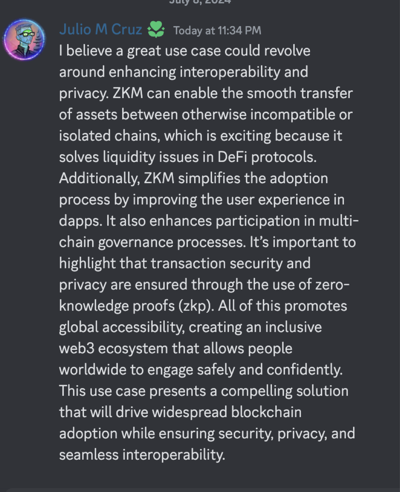

### 1.	Define universal settlement
Universal settlement refers to the permanent and final completion of a transaction. Once a transaction reaches universal settlement, it is finalized and cannot be reversed or altered.
### 2.	Why is Universal Settlement important and how is ZKM achieving this?
Universal settlement is essential because it ensures that transactions are final and irreversible, thereby fostering trust and reliability. ZKM achieves this through the use of entangled rollups, which securely record transactions on the blockchain.
### 3.	What is an Entangled Rollup? Describe its capabilities.
An entangled rollup is a mechanism that securely and trustlessly transfers messages or data between different blockchains using zero-knowledge proofs (zkp). Its main capability is to enable interoperability between diverse blockchain networks, allowing the seamless transfer of assets, messages, or funds even if the blockchains have different protocols or consensus mechanisms.
### 4.	How Does the Analogy of Quantum Entanglement Relate to ZKM’s Quantum Network?
This analogy compares the unique connection of entangled particles in quantum mechanics to ZKM’s Quantum Network. In quantum entanglement, measuring one particle’s state instantaneously determines the state of its entangled partner, regardless of the distance between them. Similarly, in ZKM’s Quantum Network, zero-knowledge proofs ensure that a statement can be validated as true without revealing any additional information, maintaining the integrity of messages across various blockchains.
###     5.	Elaborate on the Advantages that ZKM’s Quantum Network offers.

* Interoperability: Facilitates communication between blockchains with different architectures.
* Trustless Operation: Does not depend on third-party validators.
* Native Liquidity: Allows funds deposited in one layer (L1) to be used across multiple layers (L2s) and enables withdrawals to any other L1, simplifying asset management and enhancing user experience within the network.
### zkM Use Case
A promising use case for ZKM revolves around enhancing interoperability and privacy within the blockchain ecosystem. Here’s how ZKM could address these challenges:

1. Enabling Cross-Chain Asset Transfers:
ZKM can facilitate the seamless movement of assets between incompatible or isolated chains, resolving liquidity issues commonly faced by DeFi protocols.

2. Enhancing User Experience in Dapps:
By simplifying the adoption process, ZKM can significantly enhance the user experience in decentralized applications (dapps), making them more accessible and intuitive.

3. Improving Multi-Chain Governance:
ZKM would allow for better participation in multi-chain governance processes, enabling users to engage more effectively across different blockchain networks.

4. Ensuring Transaction Security and Privacy:
The use of zero-knowledge proofs (zkp) ensures the security and privacy of transactions, keeping sensitive information confidential while still being verifiable.

5. Providing Global Accessibility:
By fostering an inclusive web3 ecosystem, ZKM would enable people worldwide to participate safely and reliably, driving widespread adoption of blockchain technology.

This use case presents a comprehensive solution that promotes the widespread adoption of blockchain technology, while ensuring security, privacy, and interoperability across diverse platforms.

    